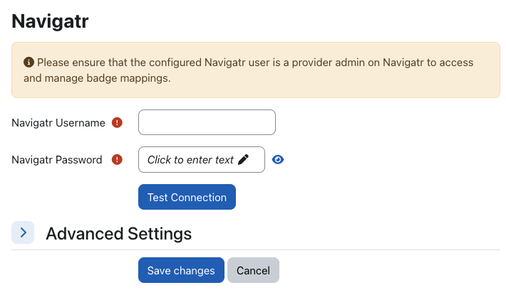
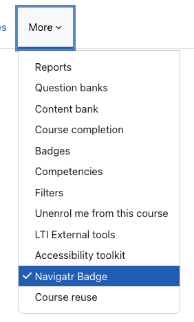
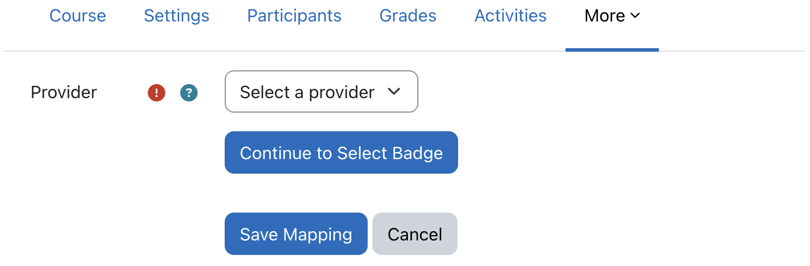
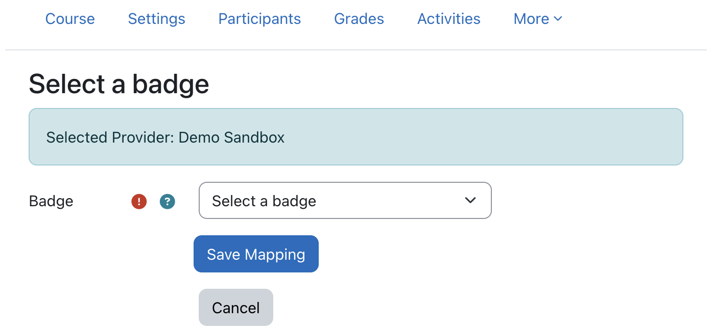
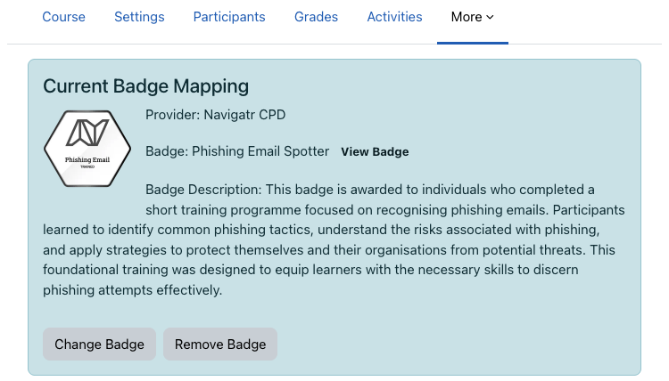

# Navigatr Plugin for Moodle

A Moodle local plugin that automatically issues Navigatr digital badges when learners complete courses.

## Overview

This plugin integrates Moodle with the Navigatr badge platform, providing:

- **Automatic Badge Issuance**: Issues badges automatically when learners complete courses
- **Course-to-Badge Mapping**: One-to-one mapping between courses and badges
- **Multi-Environment Support**: Production and staging environments
- **GDPR Compliance**: Full privacy API implementation
- **Audit Trail**: Complete logging of badge issuance attempts

## Requirements

- **Moodle**: 4.1 LTS or 5.x
- **PHP**: 8.2 or 8.3
- **Navigatr Account**: Valid Navigatr credentials

## Installation

1. Copy the plugin files to `local/navigatr/` in your Moodle installation. The following files and folders are optional and can be omitted:
   - `/scripts` (development automation)
   - `/tests` (test files)
   - `/images` (documentation screenshots)
   - `/.github` (CI/CD configuration)
   - `/.gitignore` (Git configuration)
   - `/CHANGES.md` (development documentation)
   - `/README.md` (development documentation)
2. Visit the Moodle admin notifications page to install the plugin
3. Configure Navigatr credentials in Site Administration → Plugins → Local plugins → Navigatr

## Configuration

### Plugin Settings

Navigate to **Site Administration → Plugins → Local plugins → Navigatr** to configure:

- **Credentials**: Enter your Navigatr username and password. This user should be a provider admin on Navigatr.
- **HTTP Timeout (Advanced)**: Configure request timeout (default: 30 seconds).
- **Logging Level (Advanced)**: Set debug logging level (Error, Info, Debug).
- **Environment (Advanced)**: If you would like to test with your account on the Navigatr Staging platform choose `Staging`.
- **Test Connection**: Check your username and password are correct and a connection can be made (appears as a secondary button).
- **Save Changes**: After saving your changes you are ready to configure your course mappings (appears as a primary button).



You can remove connection by clicking the "Remove Connection" button that appears when credentials are configured. But be careful before removing the connection, because this will clear your stored username, password, and authentication tokens, and it will disable existing badge mappings on your courses.

### Course Badge Mapping

For each course where you want to issue badges on completion:

1. Go to the course
2. Navigate to **Course settings → Navigatr Badge**



3. Select a provider from the dropdown and click "Continue to Select Badge"



4. Choose a badge from the provider's available badges and click "Save Mapping"



5. The badge mapping is now configured. You can:
   - **View Badge**: Click the "View Badge" link (appears inline with the badge name) to open the badge in Navigatr
   - **Change Badge**: Click the "Change Badge" button to select a different badge
   - **Remove Badge**: Click the "Remove Badge" button to remove the mapping



## API Endpoints

The plugin integrates with the following Navigatr API endpoints:

### Authentication

- `POST /v1/token` - Authenticate with username/password

### Providers

- `GET /v1/user_detail/{user_id}/providers` - List available providers

### Badges

- `GET /v1/badge?provider_id={id}&page={n}&size={m}` - List badges for a provider

### Badge Issuance

- `PUT /v1/badge/{badge_id}/issue` - Issue a badge to a recipient

## Environments

| Environment | Base URL |
|-------------|----------|
| Production | [https://api.navigatr.app/v1/](https://api.navigatr.app/v1/) |
| Staging | [https://stagapi.navigatr.app/v1/](https://stagapi.navigatr.app/v1/) |

## Database Schema

The plugin creates two database tables:

### `local_navigatr_map`

Stores course-to-badge mappings:

- `courseid` - Course ID (unique)
- `provider_id` - Navigatr provider ID
- `badge_id` - Navigatr badge ID
- `badge_name` - Badge name (cached)
- `badge_image_url` - Badge image URL (cached)

### `local_navigatr_audit`

Stores badge issuance audit records:

- `userid` - User ID
- `courseid` - Course ID
- `provider_id` - Provider ID
- `badge_id` - Badge ID
- `status` - Issuance status (success/error)
- `http_code` - HTTP response code
- `response_json` - Raw API response
- `dedupe_key` - Unique key for idempotency

## Capabilities

- `local/navigatr:managecredentials` - Manage site-level Navigatr credentials (admin only)
- `local/navigatr:configurecourse` - Configure course badge mappings (teachers/managers)

## Privacy & GDPR

The plugin implements Moodle's privacy API:

- **Data Export**: Users can export their badge issuance audit records
- **Data Deletion**: Users can request deletion of their audit records
- **External Data Transfer**: Documents transfer of PII (email, firstname, lastname) to Navigatr

## Troubleshooting

### Common Issues

1. **Authentication Failed**
   - Verify Navigatr credentials are correct
   - Check environment setting matches your Navigatr account
   - Ensure Navigatr API is accessible from your Moodle server

2. **No Providers Available**
   - Run "Test Connection" in admin settings
   - Verify your Navigatr account has access to providers

3. **Badge Issuance Fails**
   - Check audit records in database for error details
   - Verify user has required fields (email, firstname, lastname)
   - Check Navigatr API status

4. **Observer Not Registered (Badge Issuance Not Triggered)**
   - Run Moodle upgrade to force observer registration:

     ```bash
     sudo -u www-data /usr/bin/php admin/cli/upgrade.php --non-interactive
     ```

   - Or reinstall the plugin to ensure proper observer registration

5. **API Outages and Retry Mechanism**
   - **Automatic Retries**: Failed badge issuance attempts are automatically retried by Moodle's task system
   - **Retry Schedule**: Tasks retry at increasing intervals (1min, 5min, 15min, 1hr, 6hr, 24hr)
   - **No Data Loss**: All course completions during API outages are queued and will be processed when API is restored
   - **Audit Trail**: Check `local_navigatr_audit` table to see retry attempts and final outcomes
   - **Manual Retry**: If needed, failed tasks can be manually retried via Moodle's task manager

### Debugging

Enable debug logging in plugin settings to see detailed API interactions. Logs are stored in Moodle's debug log.

### HTTP Status Codes

- `200/201` - Badge issued successfully
- `400` - Bad request (missing user fields)
- `401` - Authentication failed (token expired)
- `404` - Badge or provider not found
- `5xx` - Server error (retry automatically)

## Testing

### Manual Testing

1. **Configuration Test**
   - Configure Navigatr credentials
   - Click "Test Connection" button to verify authentication
   - Click "Save Changes" to save settings
   - Verify providers are loaded

2. **Course Mapping Test**
   - Create a test course
   - Navigate to Course settings → Navigatr Badge
   - Select a provider using the "Continue to Select Badge" button
   - Choose a badge and click "Save Mapping"
   - Verify mapping is saved and buttons appear correctly

3. **Badge Issuance Test**
   - Enrol a test user in the course
   - Mark the course as complete
   - Check audit records for successful issuance

### Automated Testing

The plugin includes testing support:

**Local Testing (Quick Validation):**

```bash
# Run local tests
./scripts/test.sh

# This validates:
# - PHP syntax
# - Plugin structure
# - Security issues
# - Code quality
```

**Full Testing Suite:**

```bash
# Using moodle-plugin-ci
moodle-plugin-ci phplint
moodle-plugin-ci codechecker
moodle-plugin-ci phpunit
```

## Security Notes

- Passwords are stored encrypted in Moodle's config
- Access tokens are never logged
- All API communications use HTTPS
- User PII is only sent to Navigatr for badge issuance

## Versioning

This plugin follows semantic versioning principles. Each version release creates a new branch in the repository:

- **Main branch**: Contains the latest stable release
- **Version branches**: Each version (e.g., `v1.0.0`, `v1.1.0`) has its own branch
- **Development**: New features and fixes are developed in the `develop` branch
- **Release process**: New versions are tagged and branched from the main branch

## Contributing

We welcome contributions to improve this plugin! Here's how you can help:

### Reporting Issues

If you encounter any problems with this plugin:

1. **Create a GitHub Issue**: Please create a detailed issue on our GitHub repository
2. **Include Information**:
   - Moodle version
   - Plugin version
   - Error messages from logs
   - Steps to reproduce the issue
3. **Check Existing Issues**: Search existing issues before creating a new one

### Contributing Code

If you'd like to contribute code improvements:

1. **Fork the Repository**: Create your own fork of the repository
2. **Create a Pull Request**: Submit your changes via a pull request
3. **Code Review**: All pull requests will be reviewed by the Navigatr team
4. **Merge Process**: Approved contributions will be merged by the Navigatr team

### Development Guidelines

- Follow Moodle coding standards
- Include appropriate tests for new features
- Update documentation for any changes
- Ensure backwards compatibility where possible

## Need help with using Navigatr?

For general Navigatr platform questions, badge creation, account management, and other Navigatr-related topics, please visit the [Navigatr Help Centre](https://help.navigatr.app/).

The Help Centre contains comprehensive guides on:

- Creating and managing badges
- Setting up your Navigatr account
- Badge design and customisation
- Sharing badges on LinkedIn and other platforms
- Account settings and profile management

## Support

For issues related to:

- **Plugin functionality**: Check Moodle logs and audit records
- **Navigatr API**: Contact Navigatr support
- **Moodle integration**: Check plugin capabilities and permissions

## Changelog

See [CHANGES.md](CHANGES.md) for version history.
