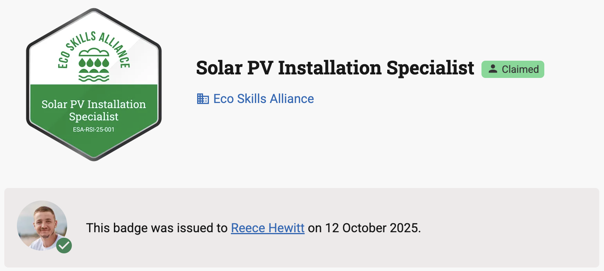

# Navigatr Plugin for Moodle

A Moodle local plugin that automatically issues Navigatr digital badges when learners complete courses.

## Why Choose Navigatr?

**Professional Digital Credentials**: Navigatr creates industry-standard digital badges that learners can proudly display on LinkedIn, resumes, and professional portfolios. [Navigatr Badge Framework](https://www.navigatr.org/navigatr-badge-framework) and [AI Badge Assistant](https://www.navigatr.org/badge-assistant) streamlines creating high quality badges in under a minute.

**Instant Verification**: Every badge is verified and include a QR code, allowing employers and institutions to instantly verify authenticity and view detailed evidence of achievement.

**Rich Evidence**: Badges showcase not just completion, but the specific skills, competencies, and evidence that led to the credential.

**Portable & Shareable**: Learners receive a permanent, shareable digital credential that travels with them throughout their career.



**Professional Certificates**: All badges can be exported as high-quality PDF certificates ready for printing and framing.


**Ready to get started?** You'll need a Navigatr provider account to use this plugin. [Register for a free trial](https://navigatr.app/register/plan/launch) to create and manage your digital badges.

## Overview

This plugin integrates Moodle with the Navigatr badging platform, providing automatic badge issuance when learners complete courses.

## Key Features

### Core Functionality

- **Automatic Badge Issuance**: Issues badges automatically when learners complete courses
- **Course-to-Badge Mapping**: One-to-one mapping between courses and badges
- **Multi-Environment Support**: Production and staging environments
- **GDPR Compliance**: Full privacy API implementation
- **Audit Trail**: Complete logging of badge issuance attempts

### Enhanced User Experience

- **Comprehensive Help System**: Help buttons on all form fields with detailed guidance
- **Contextual Documentation**: Direct links to Navigatr Help Centre for additional support
- **Improved Error Messages**: Specific, actionable error messages with troubleshooting steps
- **Form Validation**: Enhanced form field validation with helpful error messages
- **Security Warnings**: Clear information about credential storage and password visibility

### Technical Features

- **Token Management**: Automatic token refresh with lock-based concurrency control
- **Caching**: Provider and badge caching (10-minute TTL) for improved performance
- **Background Processing**: Adhoc task system with retry logic and exponential backoff
- **API Integration**: Robust Navigatr API integration with comprehensive error handling
- **Database Schema**: Optimized database tables for mappings and audit records

## Requirements

- **Moodle**: 4.1 LTS or 5.x
- **PHP**: 8.2 or 8.3
- **Navigatr Account**: Valid Navigatr credentials

## Installation

1. You will first need a Navigatr provider account. If you don't have an account, you can sign up for a free trial at [https://navigatr.app/register/plan/launch](https://navigatr.app/register/plan/launch)
2. Copy the plugin files to `local/navigatr/` in your Moodle installation. The following files and folders are optional and can be omitted:
   - `/.github` (CI/CD configuration)
   - `/.gitignore` (Git configuration)
3. Visit the Moodle admin notifications page to install the plugin
4. Configure Navigatr credentials in Site Administration → Plugins → Local plugins → Navigatr

## Configuration

### Plugin Settings

Navigate to **Site Administration → Plugins → Local plugins → Navigatr** to configure:

- **Credentials**: Enter your Navigatr username and password. This user should be a provider admin on Navigatr.
- **HTTP Timeout (Advanced)**: Configure request timeout (default: 30 seconds). Increase if you experience timeout errors.
- **Environment (Advanced)**: If you would like to test with your account on the Navigatr Staging platform choose `Staging`.
- **Test Connection**: Check your username and password are correct and a connection can be made.
- **Save Changes**: After saving your changes you are ready to configure your course mappings.
- **Help Documentation**: Links to Navigatr Help Centre are provided for additional support.


You can remove connection by clicking the "Remove Connection" button that appears when credentials are configured. But be careful before removing the connection, because this will clear your stored username, password, and authentication tokens, and it will disable existing badge mappings on your courses.

### Course Badge Mapping

For each course where you want to issue badges on completion:

1. Go to the course
2. Navigate to **Course settings → Navigatr Badge**


3. Select a provider from the dropdown and click "Continue to Select Badge"


4. Choose a badge from the provider's available badges and click "Save Mapping"


5. The badge mapping is now configured. You can:
   - **View Badge**: Click the "View Badge" link (appears inline with the badge name) to open the badge in Navigatr
   - **Change Badge**: Click the "Change Badge" button to select a different badge
   - **Remove Badge**: Click the "Remove Badge" button to remove the mapping


## API Endpoints

The plugin integrates with the following Navigatr API endpoints:

### Authentication

- `POST /v1/token` - Authenticate with username/password

### Providers

- `GET /v1/user_detail/{user_id}/providers` - List available providers

### Badges

- `GET /v1/badge?provider_id={id}&page={n}&size={m}` - List badges for a provider

### Badge Issuance

- `PUT /v1/badge/{badge_id}/issue` - Issue a badge to a recipient

## Environments

| Environment | Base URL |
|-------------|----------|
| Production | [https://api.navigatr.app/v1/](https://api.navigatr.app/v1/) |
| Staging | [https://stagapi.navigatr.app/v1/](https://stagapi.navigatr.app/v1/) |

## Database Schema

The plugin creates two database tables:

### `local_navigatr_map`

Stores course-to-badge mappings:

- `courseid` - Course ID (unique)
- `provider_id` - Navigatr provider ID
- `badge_id` - Navigatr badge ID
- `badge_name` - Badge name (cached)
- `badge_image_url` - Badge image URL (cached)

### `local_navigatr_audit`

Stores badge issuance audit records:

- `userid` - User ID
- `courseid` - Course ID
- `provider_id` - Provider ID
- `badge_id` - Badge ID
- `status` - Issuance status (success/error)
- `http_code` - HTTP response code
- `response_json` - Raw API response
- `dedupe_key` - Unique key for idempotency

## Course Backup & Restore

The plugin implements Moodle's Backup/Restore API to ensure that Navigatr badge configurations and audit records are properly included in course backups and can be restored when courses are imported or restored.

### What Gets Backed Up

#### Course Badge Mappings (Always Included)

- **Course-to-badge configuration**: Which badge is issued when users complete the course
- **Provider and badge details**: Navigatr provider ID, badge ID, badge name, and image URL
- **Timestamps**: When the mapping was created and last modified

#### Badge Issuance Audit Records (Conditionally Included)

- **Only when user data is included** in the backup
- **Complete audit trail**: Records of all badge issuance attempts for users in the course
- **API responses**: HTTP status codes and response details from Navigatr API calls
- **User information**: Which users had badges issued and when

### What Gets Restored

#### Course Badge Mappings

- **Restored automatically** when a course is restored
- **Preserves configuration**: The restored course will issue the same badge when users complete it
- **No duplicate mappings**: If a mapping already exists for the target course, it won't be overwritten

#### Badge Issuance Audit Records

- **Only restored when user data is included** in the restore operation
- **Historical record**: Maintains the audit trail of what happened in the original course
- **User ID mapping**: Automatically maps user IDs to the correct users in the target system
- **No re-issuance**: Badges are not re-issued during restore (they already exist on Navigatr's platform)

### Important Notes

- **Badges are not re-issued**: The actual badges exist on Navigatr's platform and don't need to be re-created
- **Audit trail preservation**: Restoring audit records maintains the historical record of badge issuances
- **Privacy compliance**: Audit records are only backed up/restored when user data is included
- **Course configuration**: Badge mappings are always backed up as they're part of the course structure
- **Manual testing guide**: See `docs/backup-restore-manual-testing.md` for detailed testing instructions

## Capabilities

- `local/navigatr:managecredentials` - Manage site-level Navigatr credentials (admin only)
- `local/navigatr:configurecourse` - Configure course badge mappings (teachers/managers)

## Privacy & GDPR

The plugin implements Moodle's privacy API:

- **Data Export**: Users can export their badge issuance audit records
- **Data Deletion**: Users can request deletion of their audit records
- **External Data Transfer**: Documents transfer of PII (email, firstname, lastname) to Navigatr

## Troubleshooting

### Common Issues

1. **Authentication Failed**
   - Verify Navigatr credentials are correct
   - Check environment setting matches your Navigatr account
   - Ensure Navigatr API is accessible from your Moodle server
   - Check the detailed error message for specific guidance

2. **No Providers Available**
   - Run "Test Connection" in admin settings
   - Verify your Navigatr account has access to providers
   - Ensure your Navigatr user is a provider admin

3. **Badge Issuance Fails**
   - Check audit records in database for error details
   - Verify user has required fields (email, firstname, lastname)
   - Check Navigatr API status
   - Review error messages for specific troubleshooting steps

4. **Help and Support**
   - Use the help documentation links provided in the plugin interface
   - Visit the Navigatr Help Centre for detailed guides
   - Check form field help buttons for contextual guidance

5. **Observer Not Registered (Badge Issuance Not Triggered)**
   - Run Moodle upgrade to force observer registration:

     ```bash
     sudo -u www-data /usr/bin/php admin/cli/upgrade.php --non-interactive
     ```

   - Or reinstall the plugin to ensure proper observer registration

5. **API Outages and Retry Mechanism**
   - **Automatic Retries**: Failed badge issuance attempts are automatically retried by Moodle's task system
   - **Retry Schedule**: Tasks retry at increasing intervals (1min, 5min, 15min, 1hr, 6hr, 24hr)
   - **No Data Loss**: All course completions during API outages are queued and will be processed when API is restored
   - **Audit Trail**: Check `local_navigatr_audit` table to see retry attempts and final outcomes
   - **Manual Retry**: If needed, failed tasks can be manually retried via Moodle's task manager

### Debugging

The plugin uses Moodle's built-in debug system for logging. To see detailed API interactions:

1. **Enable Moodle Debugging**: Go to **Site Administration → Development → Debugging**
2. **Set Debug Level**: Choose "DEVELOPER" for detailed logging or "NORMAL" for error logging
3. **View Logs**: Check **Site Administration → Reports → Logs** for debug information

The plugin logs important events using Moodle's event system, which are visible in the standard Moodle logs.

### HTTP Status Codes

- `200/201` - Badge issued successfully
- `400` - Bad request (missing user fields)
- `401` - Authentication failed (token expired)
- `404` - Badge or provider not found
- `5xx` - Server error (retry automatically)

## Testing

### Manual Testing

1. **Configuration Test**
   - Configure Navigatr credentials
   - Click "Test Connection" button to verify authentication
   - Click "Save Changes" to save settings
   - Verify providers are loaded

2. **Course Mapping Test**
   - Create a test course
   - Navigate to Course settings → Navigatr Badge
   - Select a provider using the "Continue to Select Badge" button
   - Choose a badge and click "Save Mapping"
   - Verify mapping is saved and buttons appear correctly

3. **Badge Issuance Test**
   - Enrol a test user in the course
   - Mark the course as complete
   - Check audit records for successful issuance

### Automated Testing

The plugin includes testing support:

**Local Testing (Quick Validation):**

```bash
# Run local tests
./scripts/test.sh

# This validates:
# - PHP syntax
# - Plugin structure
# - Security issues
# - Code quality
```

**Full Testing Suite:**

```bash
# Using moodle-plugin-ci
moodle-plugin-ci phplint
moodle-plugin-ci codechecker
moodle-plugin-ci phpunit
```

## Security Notes

- **Credential Storage**: Passwords are encrypted using AES-256-CBC encryption with site-specific keys before storage
- **Token Management**: Access tokens are never logged and are automatically refreshed when expired
- **HTTPS Communication**: All API communications use HTTPS with SSL verification enabled
- **Data Privacy**: User PII (email, firstname, lastname) is only sent to Navigatr for badge issuance
- **Password Visibility**: The password field uses `passwordunmask` for better UX - passwords are visible when editing but stored encrypted
- **Access Control**: Badge issuance is restricted to users with appropriate course completion permissions
- **Audit Trail**: All badge issuance attempts are logged for security and debugging purposes

## Versioning

This plugin follows semantic versioning principles. Each version release creates a new branch in the repository:

- **Main branch**: Contains the latest stable release
- **Version branches**: Each version (e.g., `v1.0.0`, `v1.1.0`) has its own branch
- **Development**: New features and fixes are developed in the `develop` branch
- **Release process**: New versions are tagged and branched from the main branch

## Contributing

We welcome contributions to improve this plugin! Here's how you can help:

### Reporting Issues

If you encounter any problems with this plugin:

1. **Create a GitHub Issue**: Please create a detailed issue on our GitHub repository
2. **Include Information**:
   - Moodle version
   - Plugin version
   - Error messages from logs
   - Steps to reproduce the issue
3. **Check Existing Issues**: Search existing issues before creating a new one

### Contributing Code

If you'd like to contribute code improvements:

1. **Fork the Repository**: Create your own fork of the repository
2. **Create a Pull Request**: Submit your changes via a pull request
3. **Code Review**: All pull requests will be reviewed by the Navigatr team
4. **Merge Process**: Approved contributions will be merged by the Navigatr team

### Development Guidelines

- Follow Moodle coding standards
- Include appropriate tests for new features
- Update documentation for any changes
- Ensure backwards compatibility where possible

## Need help with using Navigatr?

For general Navigatr platform questions, badge creation, account management, and other Navigatr-related topics, please visit the [Navigatr Help Centre](https://help.navigatr.app/).

The Help Centre contains comprehensive guides on:

- Creating and managing badges
- Setting up your Navigatr account
- Badge design and customisation
- Sharing badges on LinkedIn and other platforms
- Account settings and profile management

## Support

For issues related to:

- **Plugin functionality**: Check Moodle logs and audit records
- **Navigatr API**: Contact Navigatr support
- **Moodle integration**: Check plugin capabilities and permissions

## Changelog

See [CHANGES.md](CHANGES.md) for version history.
